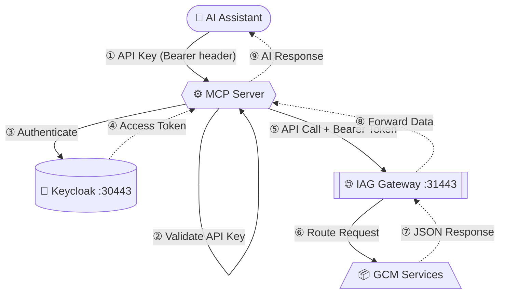

# GCM MCP Server

**Model Context Protocol (MCP) server for Guardium Cryptography Manager (GCM).**

This server provides MCP tools to interact with GCM APIs, supporting both **stdio** (local) and **SSE** (remote) transport modes.

---

## 🚀 Quick Start - Laptop Deployment (Stdio Mode)

**For IBM Bob users on laptops** - the fastest way to get started:

👉 **[See QUICKSTART.md](QUICKSTART.md)** for a 3-step setup guide.

**Summary:**
1. Clone repo and configure `.env` with GCM credentials
2. Build Docker container: `docker compose build`
3. Add to IBM Bob's MCP config and restart

**Stdio mode benefits:**
- ✅ No API key management needed
- ✅ No network ports to expose
- ✅ Lightweight and secure (process-level isolation)
- ✅ Perfect for laptop/desktop use

---

## Architecture (SSE)

**How it works — step by step:**

| Step | What happens |
| ---- | --------------------------------------------------------------- |
| ① | AI assistant sends a request to MCP Server **with API key in the `Authorization` header** |
| ② | MCP Server **validates the API key** — rejects with `401 Unauthorized` if missing or wrong |
| ③ | MCP Server sends GCM credentials to Keycloak (GCM's identity provider) |
| ④ | Keycloak validates and returns an `access_token` (5 min TTL) |
| ⑤ | MCP Server calls IAG Gateway with `Bearer <token>` |
| ⑥ | IAG routes the request to the correct GCM microservice |
| ⑦ | GCM service processes and returns JSON |
| ⑧ | IAG passes the response back to MCP Server |
| ⑨ | MCP Server formats and returns the answer to the AI assistant |

---

## Contact

**For containerization and forked gcm-mcp-server issues**: See the [forked repository](https://github.com/khirazo/gcm-mcp-server)

> **Disclaimer:** This is a Minimum Viable Product (MVP) for testing and demonstration purposes only. Not for production use. No warranty or support guarantees.

## IBM Public Repository Disclosure (Upstream)

All content in this repository including code has been provided by IBM under the associated open source software license and IBM is under no obligation to provide enhancements, updates, or support. IBM developers produced this code as an open source project (not as an IBM product), and IBM makes no assertions as to the level of quality nor security, and will not be maintaining this code going forward.
